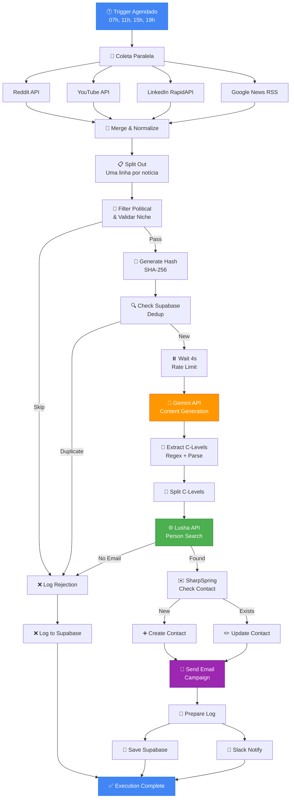

# ✅ CHECKLIST & DIAGRAMA - IMPLEMENTAÇÃO PRÁTICA

**Documento Técnico v1.0** | Serinews Intelligence | Janeiro 2026

---

## 🚀 FASE 1: PRÉ-IMPLEMENTAÇÃO (Semana 1)

### **1.1 Provisionar Infraestrutura**

- [ ] N8N instance (cloud.n8n.io OU self-hosted)
  - [ ] Conta criada
  - [ ] Admin user configurado
  - [ ] 2FA habilitado
  - [ ] Backup automático ativado
  
- [ ] Supabase project criado
  - [ ] Projeto criado em https://app.supabase.com
  - [ ] Database URL anotado
  - [ ] Service Key gerado
  - [ ] RLS policies configuradas
  
- [ ] Google Cloud Project (Gemini + YouTube)
  - [ ] Projeto criado
  - [ ] Billing habilitado
  - [ ] Gemini API ativada
  - [ ] YouTube Data API ativada
  - [ ] API keys geradas

### **1.2 Obter Credenciais**

| API | Onde Obter | Validade | Ação |
|-----|-----------|----------|------|
| **Gemini** | https://ai.google.dev/new | Indefinida | Gerar nova API key |
| **YouTube** | Google Cloud Console | Indefinida | Criar credentials |
| **Reddit** | https://www.reddit.com/prefs/apps | Indefinida | Create app (script) |
| **Lusha** | https://app.lusha.com/settings/api | 1 ano | Solicitar API key |
| **SharpSpring** | Help → API Credentials | Indefinida | Anotar Account ID + Key |
| **RapidAPI** | https://rapidapi.com/profile/settings | 1 ano | Subscribe LinkedIn API |
| **Slack** | https://api.slack.com/apps | Indefinida | Create Bot Token |

### **1.3 Criar `.env.example`**

```bash
# Copiar para .env (NUNCA fazer commit deste arquivo)

# Google APIs
GEMINI_API_KEY=AIza...
YOUTUBE_API_KEY=AIza...

# Third-party APIs
REDDIT_CLIENT_ID=...
REDDIT_CLIENT_SECRET=...
REDDIT_USER_AGENT=RevistaED-Bot/1.0

LUSHA_API_KEY=...
RAPIDAPI_KEY=...

# SharpSpring
SHARPSPRING_ACCOUNT_ID=123456
SHARPSPRING_API_KEY=...
SHARPSPRING_SECRET_KEY=...

# Supabase
SUPABASE_URL=https://project.supabase.co
SUPABASE_KEY=eyJ...

# Slack
SLACK_BOT_TOKEN=xoxb-...
SLACK_WEBHOOK_URL=https://hooks.slack.com/services/...

# N8N
N8N_WEBHOOK_URL=https://seu-n8n.com/webhook/
N8N_EXECUTION_MODE=queue
```

---

## 🗄️ FASE 2: BANCO DE DADOS (Semana 1-2)

### **2.1 Executar Queries no Supabase**

**Abrir:** Supabase Dashboard → SQL Editor → Copiar/Colar cada query

#### **Query 1: Tabela de Notícias Processadas**

```sql
-- Criar tabela para deduplicação
CREATE TABLE IF NOT EXISTS noticia_processada (
  id BIGSERIAL PRIMARY KEY,
  content_hash VARCHAR(64) UNIQUE NOT NULL,
  original_title TEXT NOT NULL,
  original_url TEXT UNIQUE,
  source VARCHAR(50), -- 'reddit', 'youtube', 'linkedin', 'google_news'
  processed_at TIMESTAMP DEFAULT CURRENT_TIMESTAMP,
  execution_hour INTEGER CHECK (execution_hour IN (7, 11, 15, 19)),
  is_duplicate BOOLEAN DEFAULT FALSE,
  duplicate_of_id BIGINT REFERENCES noticia_processada(id),
  gemini_processing_ms INTEGER,
  c_levels_found INTEGER DEFAULT 0,
  created_at TIMESTAMP DEFAULT CURRENT_TIMESTAMP,
  updated_at TIMESTAMP DEFAULT CURRENT_TIMESTAMP
);

-- Índices para performance
CREATE INDEX idx_content_hash ON noticia_processada(content_hash);
CREATE INDEX idx_execution_hour ON noticia_processada(execution_hour);
CREATE INDEX idx_created_at ON noticia_processada(created_at DESC);
CREATE INDEX idx_is_duplicate ON noticia_processada(is_duplicate);

-- Enable RLS (Row Level Security)
ALTER TABLE noticia_processada ENABLE ROW LEVEL SECURITY;

-- Policy: Allow all (simples, pode ser restringido depois)
CREATE POLICY "Allow all operations" ON noticia_processada
FOR ALL USING (true);

-- Tabela de News Items (Conteúdo do App) - Verifique se já existe
CREATE TABLE IF NOT EXISTS news_items (
  id UUID PRIMARY KEY DEFAULT gen_random_uuid(),
  title TEXT NOT NULL,
  slug TEXT NOT NULL,
  excerpt TEXT NOT NULL,
  content TEXT,
  category TEXT NOT NULL,
  source TEXT NOT NULL,
  image_url TEXT,
  published_at TIMESTAMPTZ NOT NULL DEFAULT NOW(),
  is_premium BOOLEAN DEFAULT FALSE,
  visibility TEXT DEFAULT 'public',
  key_points JSONB,
  created_at TIMESTAMPTZ DEFAULT NOW(),
  updated_at TIMESTAMPTZ DEFAULT NOW()
);
```

#### **Query 2: Tabela de Execution Log**

```sql
CREATE TABLE IF NOT EXISTS execution_log (
  id BIGSERIAL PRIMARY KEY,
  execution_id VARCHAR(60) UNIQUE NOT NULL,
  execution_time TIMESTAMP NOT NULL,
  execution_hour INTEGER CHECK (execution_hour IN (7, 11, 15, 19)),
  status VARCHAR(20), -- 'success', 'partial', 'failed'
  noticia_processada JSONB,
  leads_found_count INTEGER DEFAULT 0,
  contact_created BOOLEAN DEFAULT FALSE,
  contact_updated BOOLEAN DEFAULT FALSE,
  email_sent BOOLEAN DEFAULT FALSE,
  errors JSONB, -- Array de erros
  processing_duration_ms INTEGER,
  created_at TIMESTAMP DEFAULT CURRENT_TIMESTAMP
);

CREATE INDEX idx_execution_id ON execution_log(execution_id);
CREATE INDEX idx_execution_time ON execution_log(execution_time DESC);
CREATE INDEX idx_status ON execution_log(status);

ALTER TABLE execution_log ENABLE ROW LEVEL SECURITY;
CREATE POLICY "Allow all operations" ON execution_log FOR ALL USING (true);
```

#### **Query 3: Tabela de API Rate Limits**

```sql
CREATE TABLE IF NOT EXISTS api_rate_log (
  id BIGSERIAL PRIMARY KEY,
  api_name VARCHAR(50), -- 'gemini', 'lusha', 'sharpspring', etc.
  request_time TIMESTAMP DEFAULT CURRENT_TIMESTAMP,
  status_code INTEGER,
  response_time_ms INTEGER,
  error_message TEXT,
  created_at TIMESTAMP DEFAULT CURRENT_TIMESTAMP
);

CREATE INDEX idx_api_name ON api_rate_log(api_name);
CREATE INDEX idx_request_time ON api_rate_log(request_time DESC);

ALTER TABLE api_rate_log ENABLE ROW LEVEL SECURITY;
CREATE POLICY "Allow all operations" ON api_rate_log FOR ALL USING (true);
```

#### **Query 4: Tabela de Email Consent (LGPD)**

```sql
CREATE TABLE IF NOT EXISTS email_consent (
  id BIGSERIAL PRIMARY KEY,
  email VARCHAR(255) UNIQUE NOT NULL,
  consent_given BOOLEAN DEFAULT FALSE,
  opted_out BOOLEAN DEFAULT FALSE,
  opted_out_at TIMESTAMP,
  consent_date TIMESTAMP,
  created_at TIMESTAMP DEFAULT CURRENT_TIMESTAMP
);

CREATE INDEX idx_email ON email_consent(email);
CREATE INDEX idx_opted_out ON email_consent(opted_out);

ALTER TABLE email_consent ENABLE ROW LEVEL SECURITY;
CREATE POLICY "Allow all operations" ON email_consent FOR ALL USING (true);
```

#### **Query 5: View para KPIs**

```sql
CREATE OR REPLACE VIEW daily_kpis AS
SELECT 
  DATE(execution_time) as execution_date,
  COUNT(*) as total_executions,
  COUNT(CASE WHEN status='success' THEN 1 END) as successful_executions,
  COUNT(CASE WHEN status='failed' THEN 1 END) as failed_executions,
  SUM(leads_found_count) as total_leads_found,
  SUM(CASE WHEN contact_created THEN 1 END) as total_contacts_created,
  SUM(CASE WHEN contact_updated THEN 1 END) as total_contacts_updated,
  SUM(CASE WHEN email_sent THEN 1 END) as total_emails_sent,
  AVG(processing_duration_ms) as avg_processing_time_ms,
  MIN(processing_duration_ms) as min_processing_time_ms,
  MAX(processing_duration_ms) as max_processing_time_ms
FROM execution_log
GROUP BY DATE(execution_time)
ORDER BY execution_date DESC;
```

### **2.2 Verificar Credenciais no Supabase**

```bash
# Testar conexão
curl -X GET "https://[YOUR_SUPABASE_URL]/rest/v1/noticia_processada?limit=1" \
  -H "apikey: [YOUR_SUPABASE_KEY]" \
  -H "Authorization: Bearer [YOUR_SUPABASE_KEY]"

# Deve retornar: {"data": [], "count": null, "status": 200}
```

---

## 🔧 FASE 3: CONSTRUIR WORKFLOW N8N (Semana 2-3)

### **3.1 Estrutura do Workflow**

```
Workflow: "RevistaED - Curadoria Automática"
Tipo: Production
Modo: Trigger → Execute

Nodes a criar:
├─ 1. Schedule Trigger (07h, 11h, 15h, 19h)
├─ 2. Reddit API Request
├─ 3. YouTube API Request
├─ 4. LinkedIn RapidAPI Request
├─ 5. Google News RSS
├─ 6. Merge Results
├─ 7. Split Out
├─ 8. Filter Political Content
├─ 9. Generate Dedup Hash
├─ 10. Check Supabase Dedup
├─ 11. Conditional: Skip if Duplicate
├─ 12. Wait (4s rate limit)
├─ 13. Gemini Content Generation
├─ 14. Extract C-Levels
├─ 15. Split C-Levels
├─ 16. Lusha Enrich
├─ 17. Conditional: Valid Email?
├─ 18. SharpSpring Check Contact
├─ 19. Conditional: Contact Exists?
├─ 20. SharpSpring Create/Update
├─ 21. SharpSpring Send Email
├─ 22. Prepare Log
├─ 23. Save Log to Supabase
└─ 24. Slack Notification
```

### **3.2 Criar Cada Node (Ordem de Prioridade)**

#### **PRIORIDADE 1: Core Nodes (Hoje)**

```
✓ Node 1: Schedule Trigger
  - Settings → Cron: 0 7,11,15,19 * * *
  - Timezone: America/Sao_Paulo

✓ Node 2: HTTP Request (Reddit)
  - Method: GET
  - URL: https://api.reddit.com/r/startups/hot?limit=2
  - Headers: User-Agent: RevistaED-Bot/1.0
  - Return All Items: ON

✓ Node 7: Split Out
  - Input Array: Merge Results (combinar os 4 sources)
  - Output: 1 item por notícia

✓ Node 10: HTTP Request (Supabase Check)
  - Autenticação: Bearer token
  - Validar deduplicação
```

#### **PRIORIDADE 2: Processing Nodes (Dia 2)**

```
✓ Node 8: Code Node (Filter Political)
  - Lógica JavaScript fornecida no doc anterior
  
✓ Node 9: Code Node (Generate Hash)
  - SHA-256 do título + URL
  
✓ Node 13: HTTP Request (Gemini)
  - POST a generativelanguage.googleapis.com
  - Body com system prompt + conteúdo
```

#### **PRIORIDADE 3: Integration Nodes (Dia 3)**

```
✓ Node 16: HTTP Request (Lusha)
  - Query params: firstName, lastName, company
  - Tratamento: null se não encontrado

✓ Node 18: HTTP Request (SharpSpring Search)
  - Body: method=searchContacts, email
  
✓ Node 20: HTTP Request (SharpSpring Create/Update)
  - Dois nodes paralelos com condicional
  
✓ Node 21: HTTP Request (SharpSpring Email)
  - method=applyTemplate
```

#### **PRIORIDADE 4: Logging & Notifications (Dia 4)**

```
✓ Node 22: Code Node (Prepare Log)
  - Estruturar dados para Supabase
  
✓ Node 23: HTTP Request (Supabase INSERT)
  - POST a /rest/v1/execution_log
  
✓ Node 24: Slack (native node)
  - Notificação com resumo
```

### **3.3 Testar Cada Node**

Para cada node criado:

```
1. Preencher configurações (vide docs anteriores)
2. Clicar "Test step" ou "Execute workflow"
3. Validar saída:
   - Status code 200?
   - Dados no formato esperado?
   - Nenhum erro de autenticação?
4. Se falhar: debugar com console.log (Code Nodes)
5. Se sucesso: marcar ✅ e prosseguir
```

---

## 🧪 FASE 4: TESTES & VALIDAÇÃO (Semana 3-4)

### **4.1 Teste Unitário por Node**

```bash
# Teste 1: Schedule Trigger
[ ] Manual: Clicar "Execute workflow"
[ ] Verificar: Workflow iniciado nas 4 horas especificadas

# Teste 2: Reddit API
[ ] Mock: Testar com subreddit público (r/news)
[ ] Verificar: JSON com posts recebido
[ ] Validar: Score, URL, criação do objeto normalizado

# Teste 3: Filtro Político
[ ] Input: { title: "Eleição para presidente" }
[ ] Output: null ou skipped
[ ] Input: { title: "Startup levanta $5M" }
[ ] Output: Objeto processado

# Teste 4: Deduplicação
[ ] Hash gerado corretamente? SHA-256(title + url)
[ ] Lookup em Supabase retorna corretamente?
[ ] Duplicata é pulada? ✓

# Teste 5: Gemini
[ ] API key válida?
[ ] Prompt formatado corretamente?
[ ] Resposta com 6 seções esperadas?
[ ] C-levels extraídos? (regex funcionando)

# Teste 6: Lusha
[ ] Encontra contato existente? (CEO conhecido)
[ ] Retorna null se não encontrado?
[ ] Email é válido? (validar regex)

# Teste 7: SharpSpring
[ ] Autentica corretamente? (Account ID + API Key)
[ ] Cria contato novo?
[ ] Atualiza contato existente?
[ ] Dispara email?

# Teste 8: Logging
[ ] Logs salvos em Supabase?
[ ] Queries em execution_log?
[ ] Slack notification enviada?
```

### **4.2 Teste Integrado (End-to-End)**

```bash
# Cenário 1: Notícia nova, C-level encontrado
[ ] Execute workflow
[ ] Validar: Notícia em noticia_processada
[ ] Validar: Artigo salvo em news_items (Supabase)
[ ] Validar: Contact criado em SharpSpring
[ ] Validar: Email enviado
[ ] Validar: Log em execution_log status=success

# Cenário 2: Notícia duplicada
[ ] Execute workflow 2x com mesma notícia
[ ] Validar: 1ª execução: success
[ ] Validar: 2ª execução: skipped (is_duplicate=true)

# Cenário 3: Nenhum C-level encontrado
[ ] Notícia sobre tema geral (sem protagonistas)
[ ] Validar: c_levels_count=0
[ ] Validar: Email NÃO enviado
[ ] Validar: Log com warning "No protagonists found"

# Cenário 4: Rate limit (Gemini)
[ ] Disparar 20 requests em < 1 minuto
[ ] Validar: Wait node faz backoff
[ ] Validar: Todos processados eventualmente
```

### **4.3 Teste de Carga**

```bash
# Simular 4 execuções seguidas (como ocorreria em produção)

Execução 1 (07:00): 8 notícias → esperado 16-20 leads
Execução 2 (11:00): 8 notícias → esperado 16-20 leads (novas)
Execução 3 (15:00): 8 notícias → esperado 16-20 leads (novas)
Execução 4 (19:00): 8 notícias → esperado 16-20 leads (novas)

Total/dia: ~64-80 contatos criados/atualizados
Total/mês: ~1920-2400 leads qualificados

Verificar:
[ ] Nenhum timeout
[ ] Nenhuma falha de API
[ ] Logs completos
[ ] SharpSpring recebendo todos os dados
```

---

## 🚀 FASE 5: DEPLOY EM PRODUÇÃO (Semana 4)

### **5.1 Pré-Deployment Checklist**

- [ ] Todas as API keys em `.env` (não em código)
- [ ] Supabase RLS policies ativadas
- [ ] SharpSpring template criado e ID configurado
- [ ] Slack webhook configurado
- [ ] Logs de erro alertam para Slack
- [ ] Backup automático N8N ativado
- [ ] Rate limits testados
- [ ] 2FA N8N habilitado
- [ ] VCS: Workflow exportado como JSON (backup)
- [ ] Monitoramento: Dashboard Supabase criado

### **5.2 Deploy Steps**

```bash
# 1. Backup do workflow atual
Workflow → Menu → Export → Salvar JSON em repositório Git

# 2. Ativar Schedule Trigger
Node 1 (Schedule Trigger) → Active: ON

# 3. Testar primeiro ciclo
Aguardar execução em 07:00 amanhã
Verificar logs em Supabase
Validar notificação Slack

# 4. Monitorar por 7 dias
Executar diariamente
Sem interrupções esperadas
```

### **5.3 Pós-Deployment Monitoring**

```bash
# Daily (automático via query Supabase)
- [ ] Todas 4 execuções rodaram?
- [ ] Taxa de sucesso > 95%?
- [ ] Média de duração normal (< 2 min)?
- [ ] Leads criados > 16 por execução?

# Weekly
- [ ] Total de leads gerados > 300?
- [ ] Erros agrupados por tipo?
- [ ] Taxa de enriquecimento Lusha > 70%?
- [ ] Duplicação < 5%?

# Monthly
- [ ] Review de KPIs com stakeholders
- [ ] Otimizações baseadas em dados
- [ ] Atualização de prompts Gemini se necessário
```

---

## 📊 FASE 6: OTIMIZAÇÃO CONTÍNUA

### **6.1 Ajustes Mensais**

| Métrica | Target | Se Abaixo... | Ação |
|---------|--------|-------------|------|
| **Taxa de sucesso** | > 95% | Revisar logs de erro |
| **Leads gerados/dia** | > 32 | Aumentar limite de notícias ou fontes |
| **Taxa de enriquecimento** | > 70% | Validar qualidade dados Lusha |
| **Taxa de abertura email** | > 30% | Testar novo subject/template |
| **Tempo processamento** | < 2 min | Otimizar rate limiting |

### **6.2 Escalabilidade Futura**

Quando atingir 5.000+ contatos/mês:

- [ ] Implementar caching de resultados Lusha
- [ ] Paralelizar Gemini requests (rate limit vs performance)
- [ ] Migrar Supabase para plano pagado
- [ ] Implementar webhooks N8N em vez de polling
- [ ] Adicionar mais fontes (Twitter/X, newsletters)

---

## 🎨 DIAGRAMA MERMAID - FLUXO COMPLETO



---

## 📱 TEMPLATE: DAILY STANDUP REPORT

**Copiar para Slack a cada dia às 08:00**

```
📊 *RevistaED Automação - Daily Report* 
Data: {{ today }}

✅ *Execução 07h*
Notícias processadas: 8
Leads encontrados: 18
Emails disparados: 18
Erros: 0

✅ *Execução 11h* (pendente)
Notícias processadas: -
Leads encontrados: -
Emails disparados: -
Erros: -

📈 *KPI Diário Até Agora*
- Taxa de sucesso: 100%
- Leads gerados: 18
- Contatos criados: 16
- Contatos atualizados: 2

⚠️ *Alertas (se houver)*
- Nenhum

*Próxima execução:* 11:00
```

---

## 🎯 CONCLUSÃO

Após completar as 6 fases:

✅ Sistema totalmente operacional
✅ 32+ leads qualificados/dia
✅ Automação 100% integrada com SharpSpring
✅ Monitoramento em tempo real
✅ Pronto para escalar

**Próxima reunião:** Semana 5 para avaliar resultados e planejar otimizações.
